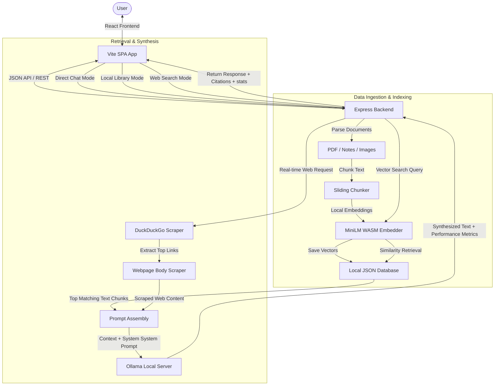

# InsightFlow AI: Local RAG Knowledge Base & Web Search Copilot

InsightFlow AI is a high-performance, privacy-first local AI assistant. It functions as a Local Retrieval-Augmented Generation (RAG) system, an offline document database, and an online real-time search engine. By combining local vector search with on-demand parallel web scraping, InsightFlow AI provides comprehensive answers without sending your private files or search terms to third-party cloud AI vendors.

---

## 🏗️ System Architecture

The following diagram illustrates how InsightFlow AI ingests documents, indexes vectors, executes search retrieval (Local RAG vs. Web Search), and processes offline synthesis:



---

## 🌟 Key Features

*   **🔒 Privacy-First Offline RAG**: Parses and vectorizes PDFs, text notes, and bookmarks natively on your computer.
*   **🧠 Local WASM Embeddings**: Running `all-MiniLM-L6-v2` locally inside Node.js via `@xenova/transformers`. This eliminates any Ollama embedding timeouts or context limits.
*   **🌐 Real-Time Web Search synthesis**: Custom DuckDuckGo scraper combined with parallel body text extraction. This crawls and vectorizes raw article text on-demand to fetch news and answer queries.
*   **⚡ LLM Hardware Memory Center**: Start (load) and Stop (unload) local LLMs directly from the UI, preloading models to VRAM or ejecting them instantly to free up system memory when not in use.
*   **📊 Inline Inference Metrics**: View tokens-per-second (t/s) and generation time badges under every response.
*   **🔍 Interactive Citation Popovers**: Click source chips to view the exact text snippets retrieved from the database that informed the response.
*   **📑 Markdown Exporter**: Save entire chat sessions (including formatting, citation tables, and speed logs) as `.md` documents.
*   **🎨 Collapsible Sidebar & Dynamic Themes**: Collapse the sidebar to a slim icon-only bar (72px) and toggle between AMOLED Black, Midnight Slate, or Glass Light mode.

---

## 📂 Project Structure

```
local-rag-kb/
├── backend/                # Express.js Server
│   ├── uploads/            # Temporary file upload vault
│   ├── db.js               # Sliding text chunking, WASM embedder, JSON DB
│   ├── search.js           # DuckDuckGo HTML parser & webpage crawlers
│   ├── server.js           # REST API routes & Ollama controllers
│   └── db.json             # Persistent file indexes, chat sessions & metrics
├── frontend/               # React client SPA (Vite)
│   ├── src/
│   │   ├── components/     # Chat, Library, Settings, Sidebar & Modals
│   │   ├── utils/          # API integrations & client CRUD
│   │   ├── App.jsx         # App routes, global state, theme bindings
│   │   └── index.css       # Responsive glassmorphic stylesheets
│   └── vite.config.js      # React dev configuration
├── package.json            # Concurrently execution scripts
└── README.md               # Main Architecture Documentation
```

---

## 🚀 Getting Started

### Prerequisites & Local Model Setup

InsightFlow AI runs entirely offline using **Ollama** as its local model inference engine. Follow these steps to set up your environment:

#### 1. Download & Install Ollama
*   Go to the official [Ollama Download Page](https://ollama.com/download) and install the software for your operating system.
*   Once installed, ensure the Ollama application is running (you should see the Ollama icon in your menu bar or system tray).

#### 2. Pull Models via Command Line (Recommended)
Open your terminal (PowerShell, Command Prompt, or bash) and pull the models required for chat synthesis and document embedding:
*   **Chat Model (LLM)**: Pull a chat model (we recommend `llama3` as default, but any model like `llama3.1`, `mistral`, or `phi3` works):
    ```bash
    ollama pull llama3
    ```
*   **Embedding Model**: Pull an embedding model (we recommend `nomic-embed-text` for highly accurate vector search results):
    ```bash
    ollama pull nomic-embed-text
    ```

#### 3. Pull Models via the App UI
Alternatively, you can pull models directly inside the InsightFlow dashboard:
1. Start the application servers (`npm run dev`).
2. Navigate to **Settings** (click on **Account & Settings** in the sidebar footer).
3. Find the **Pull Ollama Models** card.
4. Input the model name (e.g. `llama3` or `nomic-embed-text`) and click **Pull**. The server will download the model in the background.

#### 4. Manage RAM/VRAM Hardware Memory
Under the **Settings** panel, you'll find the **LLM Hardware Memory Center**:
*   **🟢 Run (Load)**: Immediately preloads a model into VRAM, eliminating the initial loading latency on your first chat query.
*   **🔴 Stop (Unload)**: Immediately unloads a model from RAM/VRAM, instantly freeing up system resources when you are done.

### Installation
1. Clone this repository:
   ```bash
   git clone https://github.com/k1chandrasekhar/insightflow-ai.git
   cd insightflow-ai
   ```
2. Install dependencies for the entire workspace:
   ```bash
   npm run install-all
   ```

### Running Locally
Run both frontend and backend development servers concurrently:
```bash
npm run dev
```

*   **Frontend Client**: [http://localhost:5173/](http://localhost:5173/)
*   **Backend Server**: [http://localhost:5000/](http://localhost:5000/)

---

## 🤝 Contribution Guidelines
Feel free to fork this project, submit pull requests, or log bug reports on the repository issue tracker.
