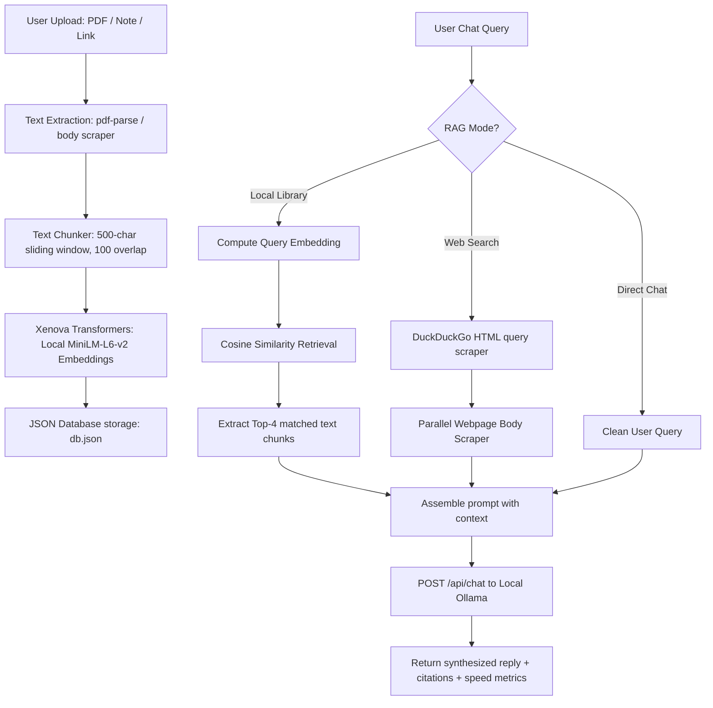

# InsightFlow AI: Express.js Backend Server

This directory contains the Express.js server code for InsightFlow AI. It manages document processing, text chunking, local WASM-based vector embeddings, persistent database logs, real-time web scraping, and connection proxies for local Ollama servers.

---

## 🏗️ Backend Pipeline Architecture

The following flowchart details how raw files, notes, and web URLs are ingested, converted into mathematical vector coordinates, and retrieved for LLM queries:



---

## 🛠️ Key Engine Components

### 1. Ingestion & Embedding Engine (`db.js`)
*   **WASM Embedder**: Loads `@xenova/transformers` with the `all-MiniLM-L6-v2` model natively on server boot. This model runs locally in JavaScript, compiling directly to WebAssembly.
*   **Text Splitter**: Splits long text files and PDFs into segments of `500 characters` with a `100 character` sliding overlap.
*   **Cosine Similarity**: Calculates vector distance between query terms and text chunks locally without external API keys.

### 2. Web Search Crawler (`search.js`)
*   **DuckDuckGo Scraper**: Queries `html.duckduckgo.com/html` under custom User-Agent masquerading to retrieve top search results safely and rapidly.
*   **Parallel Web Crawler**: Pulls raw HTML bodies from the top 3 web results simultaneously. It strips out `<script>`, `<style>`, and HTML tag definitions to extract clean text.

### 3. VRAM Hardware Lifecycle Controller (`server.js`)
*   **Active Monitor**: Connects to Ollama's `GET /api/ps` endpoint, parsing which LLM models are currently running in RAM or VRAM, including their VRAM sizing and remaining cache lease times.
*   **Preloader**: Calls `POST /api/generate` with an empty prompt and a lease timeout (`keep_alive: "20m"`) to spin up local LLMs instantly.
*   **VRAM Unloader**: Calls `POST /api/generate` with `keep_alive: 0`, causing the Ollama daemon to immediately eject the model from RAM/VRAM, freeing up system hardware for other tasks.

---

## 📡 REST API Specifications

### Document Library
*   `GET /api/items` - Lists all indexed documents, notes, bookmarks, and images.
*   `POST /api/items` - Creates a new note or bookmark. If bookmark content is empty, triggers `search.js` to automatically crawl, scrape, and vectorize the URL's text.
*   `POST /api/upload` - Receives PDF or image files. Parses text from PDFs or catalogs image cards. Generates embeddings and updates `db.json`.
*   `DELETE /api/items/:id` - Deletes a document, notes file, or image card, removing its associated vector embeddings.

### Chat Sessions
*   `GET /api/sessions` - Returns previous sessions.
*   `POST /api/sessions` - Starts a new chat session history chain.
*   `DELETE /api/sessions/:id` - Deletes a session and all its associated message logs.
*   `GET /api/sessions/:id/messages` - Fetches message chains belonging to a session.

### Ollama Hardware Manager
*   `GET /api/ollama/status` - Checks connections and lists all downloaded models.
*   `GET /api/ollama/active` - Lists active models loaded in VRAM.
*   `POST /api/ollama/load` - Preloads a model into memory.
*   `POST /api/ollama/unload` - Unloads a model, immediately releasing VRAM.

### Query RAG
*   `POST /api/query` - Receives user queries, runs vector searches or web scrapes, compiles prompt templates, fetches LLM replies from Ollama, and appends generation metrics.

---

## 🚀 Running the Backend Individually

To start the server independently:
```bash
cd backend
npm install
node server.js
```

The server runs on [http://localhost:5000/](http://localhost:5000/).
