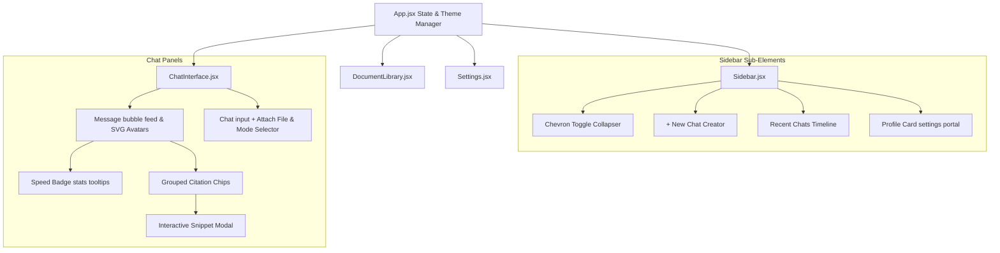

# InsightFlow AI: Frontend Client Dashboard

This directory houses the frontend web client of InsightFlow AI. It is built as a single-page dashboard application using **React**, **Vite**, and **Vanilla CSS**.

---

## 🎨 Design System & Visuals

The client is built using a custom, modern **glassmorphic design system** styled entirely using CSS variables. Key styling capabilities include:
*   **Adaptive Theme System**: Instantly overrides CSS custom properties dynamically in the document root when swapping between:
    *   **Classic Dark**: Dark blue-grey slate with translucent frosted-glass panels.
    *   **AMOLED Black**: True black background (`#000000`) for high-contrast accessibility and power efficiency.
    *   **Glass Light**: Frosted white layouts with dark text. All text color variables (like `--text-primary`) are mapped to adapt dynamically, eliminating unreadable contrast.
*   **Smooth Layout Transitions**: Handles sidebar collapsing and tab shifts using CSS transitions and transform animations.

---

## 🏗️ UI Component Architecture



---

## 📂 Component Directory Breakdown

### 1. `Sidebar.jsx`
*   **Collapsible Sidebar**: A chevron button toggles the sidebar size between `260px` (expanded) and `72px` (collapsed). When collapsed, labels and text are hidden dynamically in favor of round, icon-only bubbles.
*   **Chat Session History**: Lists all active conversation sessions. Clicking a session switches the view to Chat, and clicking the trashcan icon deletes it.
*   **Profile Footer Card**: Displays the user's name and avatar. Clicking it navigates to the Settings panel. It also handles subtext labels showing "Account & Settings" for clean UX routing.

### 2. `ChatInterface.jsx`
*   **Chat Input & Uploader (`+` button)**: The input bar contains a paperclip button which uploads and vectorizes files in the background without leaving the chat interface.
*   **Performance Metrics**: Highlights response latency, word counts, and evaluation speed (`t/s`) calculated directly from Ollama metadata.
*   **Grouped Source Citations**: Client-side de-duplication merges duplicate vector segments retrieved from the same document under a single card showing the highest similarity rating.
*   **Multi-Snippet Popover**: Clicking a citation chip triggers a modal showing all text paragraphs retrieved from that document.
*   **Markdown Exporter**: Combines the chat session, speed badges, and source tables into a clean `.md` document for download.

### 3. `DocumentLibrary.jsx`
*   **Multi-Type Resource Catalog**: Filters items by Notes, Bookmarks, and PDFs.
*   **Responsive Cards**: Serves cards with hover animations and dynamic preview zooms.
*   **Item Modals**: Contains forms to create text notes or add bookmarks. Submit triggers the backend auto-crawlers if a bookmark content textbox is left empty.

### 4. `Settings.jsx`
*   **Hardware VRAM Control**: Displays running models, VRAM sizes, and countdown expirations. Includes Green **Run (Load)** and Red **Stop (Unload)** buttons to pull local LLMs in/out of memory.
*   **Ollama Downloader**: Pulls new models (e.g. `nomic-embed-text`) directly from the Ollama registry.
*   **Account Settings Form**: Updates username, initials, and email details, immediately broadcasting changes to sync the sidebar profile footer in real-time.

---

## 🚀 Running the Frontend Individually

If you need to start the React client alone:
```bash
cd frontend
npm install
npm run dev
```

The client will spin up at [http://localhost:5173/](http://localhost:5173/). Make sure the backend server (port 5000) is running for the API calls to function.
